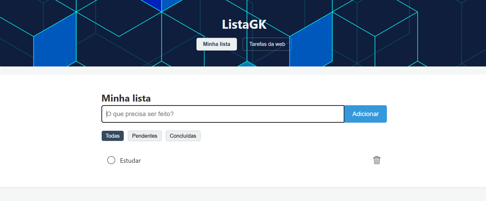
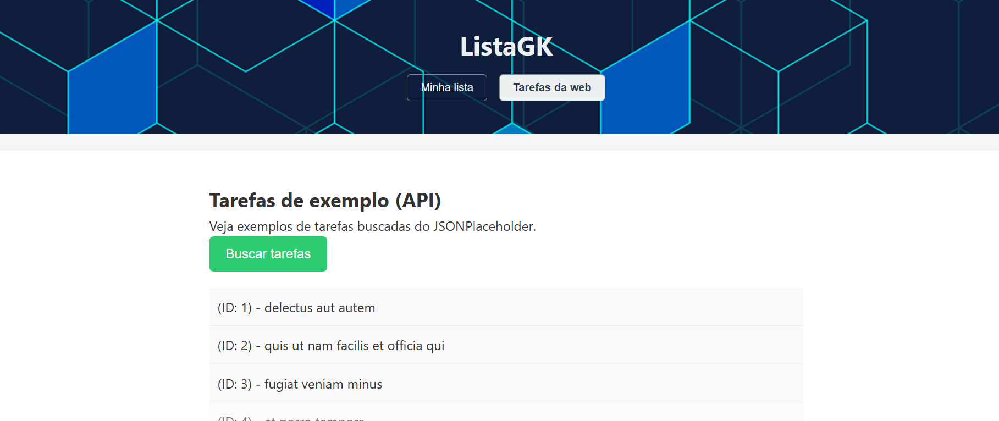

# ListaGK 

Este trabalho consiste numa aplicação web estilo "To-Do List".

O objetivo foi construir um sistema que cumpra todos os requisitos de um projeto front-end, incluindo manipulação do DOM, programação orientada a objetos, programação funcional e consumo de API (AJAX).

## Telas (Screenshots)

**Tela Principal (Minha lista)**


**Tela de Tarefas da web (API)**


##  Funcionalidades

O projeto é dividido em duas seções principais:

#### 1. Minha lista (CRUD)
* **Adicionar** novas tarefas (Create).
* **Visualizar** todas as tarefas (Read).
* **Atualizar** tarefas, marcando-as como concluídas (Update).
* **Excluir** tarefas da lista (Delete).
* **Filtrar** a visualização entre "Todas", "Pendentes" e "Concluídas".
* **Persistência de Dados:** As tarefas da lista pessoal são salvas no `LocalStorage` do navegador, para que não se percam ao recarregar a página.

#### 2. Tarefas da web (AJAX)
* Consumo de uma API pública (JSONPlaceholder) via `Fetch API`.
* Um clique no botão "Buscar Tarefas" exibe 10 tarefas de exemplo na tela, demonstrando a comunicação assíncrona.

---

## Tecnologias utilizadas

Este projeto foi construído do zero **sem o uso de frameworks ou bibliotecas externas** (exceto onde o jQuery era permitido, embora `Fetch` tenha sido usado como padrão moderno).

* **HTML5:** Estrutura semântica (`<header>`, `<main>`, `<section>`, `<footer>`).
* **CSS3:** Layout responsivo com Flexbox, estilização e classes dinâmicas.
* **JavaScript (Puro):**
    * **Manipulação do DOM:** Criação, seleção e atualização de elementos (`createElement`, `addEventListener`, `classList`, etc.).
    * **Orientação a objetos:** Uso da `class Tarefa` para modelar os dados.
    * **Programação funcional:** Uso de métodos de array como `.map()` e `.filter()` para renderização e lógica de filtros.
    * **AJAX:** Consumo de API com `Fetch API` (async/await) para buscar dados externos.
    * **LocalStorage:** Armazenamento de dados no navegador.

---

## Como executar o projeto

Como é um projeto web estático (apenas HTML, CSS e JS), não há necessidade de instalação de dependências.

1.  **Clonar o repositório:**
    ```bash
    git clone https://github.com/seu-usuario/ListaGK.git
    ```
    *(Lembre-se de alterar `seu-usuario/ListaGK` para a URL do seu repositório)*

2.  **Abrir no navegador:**
    Simplesmente abra o arquivo `index.html` no seu navegador de preferência.

3.  **(Recomendado) Rodar com um servidor local:**
    Para garantir que todas as requisições (como o `Fetch`) funcionem sem problemas de CORS, é recomendado usar um servidor local. Se você tiver o Node.js instalado, pode usar o `live-server`:
    ```bash
    # Instale globalmente (apenas uma vez)
    npm install -g live-server

    # Na pasta do projeto, execute:
    live-server
    ```

---

## Estrutura das pastas

O projeto segue uma organização de arquivos:

projeto-final/ ├── css/ │ └── style.css ├── js/ │ ├── api.js │ ├── classes.js │ ├── dom.js │ ├── funcoes.js │ └── main.js ├── assets/ │ ├── check-cheio.png (ou .svg) │ ├── check-vazio.png │ ├── fundo-header.png │ └── lixeira.png ├── screenshots/ │ ├── tela-principal.png │ └── tela-api.png ├── index.html └── README.md


---

##  Autor

Desenvolvido por **Gilberto Krein** - 2025.